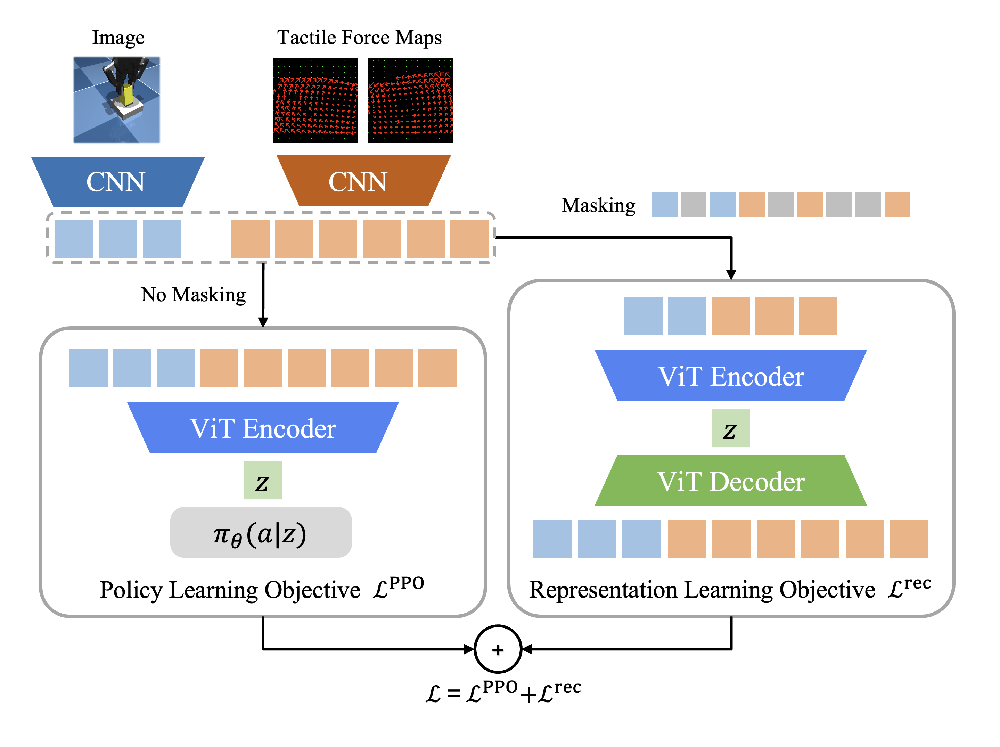

# The Power of the Senses: Generalizable Manipulation from Vision and Touch through Masked Multimodal Learning

[Paper](https://arxiv.org/abs/2311.00924) [Website](https://sferrazza.cc/m3l_site/)

Masked Multimodal Learning (**M3L**) is a representation learning technique for reinforcement learning that targets robotic manipulation systems provided with vision and high-resolution touch.



## Installation
Please install [`tactile_envs`](https://github.com/carlosferrazza/tactile_envs.git) first. Then, install the remaining dependencies:
```
pip install -r requirements.txt
```

## Training M3L
```
MUJOCO_GL='egl' python train.py --env tactile_envs/Insertion-v0
```

## Training M3L (vision policy)
```
MUJOCO_GL='egl' python train.py --env tactile_envs/Insertion-v0 --vision_only_control True
```
## Citation
If you find M3L useful for your research, please cite this work:
```
@article{sferrazza2023power,
  title={The power of the senses: Generalizable manipulation from vision and touch through masked multimodal learning},
  author={Sferrazza, Carmelo and Seo, Younggyo and Liu, Hao and Lee, Youngwoon and Abbeel, Pieter},
  journal={arXiv preprint arXiv:2311.00924},
  year={2023}
}
```

## References
This codebase contains some files adapted from other sources:
* vit-pytorch: https://github.com/lucidrains/vit-pytorch
